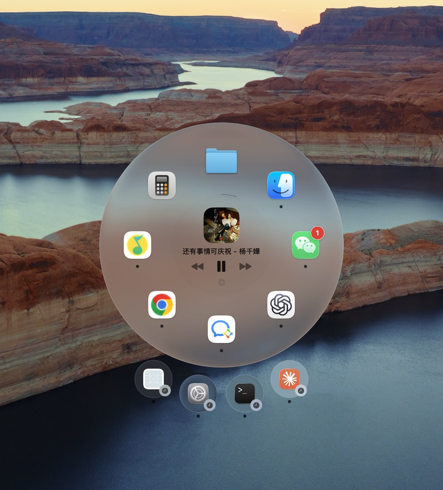
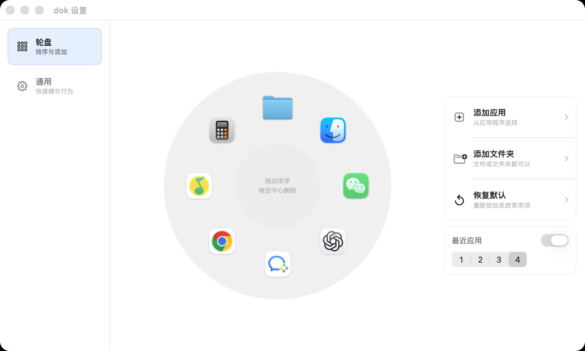
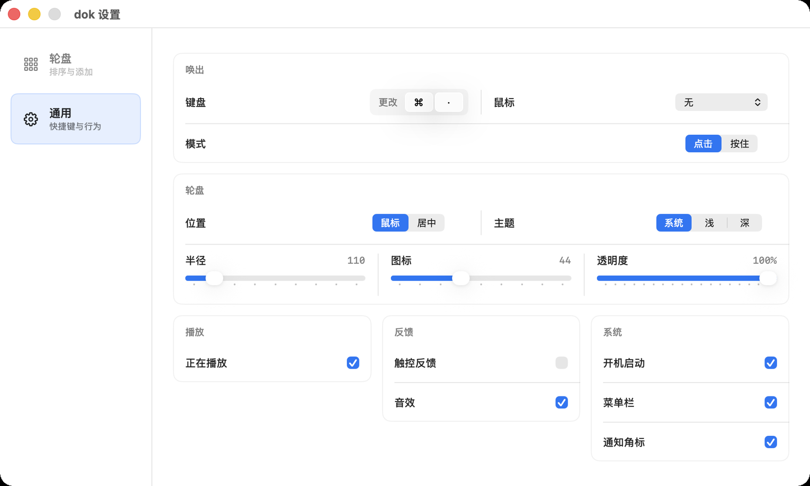

# dok

<p align="center">
  
</p>

<p align="center">
  <strong>A liquid-glass command wheel for macOS.</strong><br>
  <strong>一款 macOS 液态玻璃轮盘启动器。</strong>
</p>

<p align="center">
  
  
  
  
</p>

dok puts your everyday Mac actions under your cursor: launch apps, open files, folders, and websites, and control music from a quiet radial menu.

dok 把高频操作放到鼠标附近：启动应用、打开文件、文件夹和网址、控制音乐，都在一个轻量的轮盘里完成。

Every feature is available for free. dok has no account requirement, paid tier, or in-app purchase.

全部功能免费开放，不需要账号，没有付费分层，也没有应用内购买。

dok requires macOS 13.0 or later and ships as a Universal 2 app for Apple Silicon and Intel Macs. macOS 26 uses native Liquid Glass; macOS 13–15 use an adaptive compatibility material while keeping the same features and layout.

dok 需要 macOS 13.0 或更高版本，并以 Universal 2 形式同时支持 Apple Silicon 与 Intel Mac。macOS 26 使用原生 Liquid Glass；macOS 13–15 自动使用兼容玻璃材质，功能和布局保持一致。

## Latest Update: 1.3.0 / 最新更新：1.3.0

- One Universal 2 download now supports macOS 13+, Apple Silicon, and Intel Macs / 一个 Universal 2 安装包同时支持 macOS 13+、Apple Silicon 与 Intel Mac
- macOS 26 keeps the approved native Liquid Glass; macOS 13–15 automatically use the compatibility material / macOS 26 保持已定稿的原生 Liquid Glass，macOS 13–15 自动切换兼容玻璃材质
- Signed with Developer ID and notarized by Apple for normal installation / 使用 Developer ID 签名并通过 Apple 公证，可直接正常安装

[View the full release notes and download dok 1.3.0](https://github.com/chillintheshade/dok/releases/tag/v1.3.0)

[查看完整更新说明并下载 dok 1.3.0](https://github.com/chillintheshade/dok/releases/tag/v1.3.0)

## Preview / 预览

<p align="center">
  
</p>

<p align="center">
  
</p>

<p align="center">
  
</p>

## Highlights / 亮点

- True liquid glass: the wheel samples your desktop through macOS's native glass material, the same look as Control Center  
  真·液态玻璃：轮盘用系统原生玻璃材质实时采样桌面，观感与控制中心同源
- Music at the center: artwork, track info, a minimal progress arc — tap the arc to seek  
  中心音乐区：封面、曲目和极简进度弧，点按进度弧即可跳转播放位置
- Works out of the box on every Mac: track info requires no developer tools, thanks to a bundled adapter running on Apple-signed Perl  
  所有 Mac 开箱即用：歌曲信息不依赖任何开发者工具，由内置 adapter 借系统 Perl 读取
- Recent-content satellites orbit below the wheel for apps and folders; files and websites stay only where you placed them
  最近使用的应用和文件夹以「卫星」形式停在轮盘下缘；文件和网址只保留在固定槽位
- Dock-style notification badges on wheel slots and satellites  
  槽位和卫星显示与 Dock 一致的未读角标
- Right-click a running app to quit it without leaving the wheel  
  右键运行中的应用槽位，可直接退出该应用
- Launch by hotkey or mouse button, in click or hold-and-release mode  
  支持快捷键或鼠标按键唤出，可选「点击」或「按住-松开」两种模式
- Adjustable radius, icon size, opacity, theme, and position; English and Simplified Chinese UI  
  半径、图标、透明度、主题、唤出位置皆可调；支持英文和简体中文界面

## Download / 下载

Download the latest DMG from [GitHub Releases](https://github.com/chillintheshade/dok/releases/latest), then drag `dok.app` into `/Applications`.

从 [GitHub Releases](https://github.com/chillintheshade/dok/releases/latest) 下载最新 DMG，然后把 `dok.app` 拖到 `/Applications`。

The release is signed with a Developer ID certificate and notarized by Apple. macOS can verify it normally; no Terminal command is required.

发布版本已使用 Developer ID 证书签名并通过 Apple 公证，macOS 可以正常验证，无需执行终端命令。

## Build From Source / 从源码构建

```bash
swift build -c release
for test in work/*-test.py; do python3 "$test" || exit 1; done
xcodebuild -project dok.xcodeproj -scheme dok -configuration Release build CODE_SIGNING_ALLOWED=NO
```

The Swift package build is the fast compile check. Use the Xcode project to produce the full `.app` with assets and localized resources.

Swift Package 用于快速编译检查；需要完整 App、图标和本地化资源时，请使用 Xcode 工程构建。

The bundle identifier still uses `com.qingshan.orbis` to preserve update compatibility. The user-facing app name is `dok`.

为了兼容旧版本更新，bundle identifier 仍然保留 `com.qingshan.orbis`；用户看到的名称是 `dok`。

## Music Support / 音乐功能说明

**Everything works out of the box on every Mac — no developer tools required.** When available, playback controls use the bundled MediaRemote adapter; system media keys are a fallback only. Track name and artwork are read through the same helper framework ([mediaremote-adapter](https://github.com/ungive/mediaremote-adapter), BSD-3-Clause), which runs on the system's Apple-signed Perl interpreter. Placeholder play brings the preferred running player forward and records a short-lived intent; Play is sent only after that player exposes a controllable session, so an ownerless media key cannot accidentally launch Apple Music.

**所有功能开箱即用，不需要安装任何开发工具。** 播放控制优先通过打包的 MediaRemote adapter 发送，只有 adapter 不可用时才退回系统媒体按键。占位状态点击播放会把优先播放器带到前台并记录短时意图；目标播放器建立可控会话后才补发播放，因此不会因无会话所有者而误启 Apple Music。歌名和封面由同一个 helper 框架（[mediaremote-adapter](https://github.com/ungive/mediaremote-adapter)，BSD-3-Clause 协议）读取，它借助系统自带、Apple 签名的 Perl 解释器运行。

## FAQ / 常见问题

**The menu bar icon is missing. / 菜单栏图标不见了？**

macOS 26 can hide any app from the menu bar system-wide. Open System Settings → Menu Bar → "Allow in the Menu Bar" and switch dok on.

macOS 26 可以在系统层面隐藏某个 App 的菜单栏图标。打开 系统设置 → 菜单栏 → 「允许在菜单栏显示」，把 dok 打开即可。

**A player is running but the wheel shows no track. / 播放器开着，轮盘却不显示歌曲？**

Some players (QQ Music, for example) don't register a system Now Playing session until you press play once inside the app. Start playback there first; dok picks it up automatically.

部分播放器（例如 QQ音乐）在手动播放一次之前不会向系统注册「正在播放」会话。先在播放器里点一次播放，dok 就会自动读到。

**The mouse trigger doesn't respond. / 鼠标触发没反应？**

Mouse-button triggers require Accessibility permission. dok's General settings shows a grant shortcut whenever it is needed.

鼠标按键触发需要「辅助功能」权限，需要时设置页会显示去授权入口。

## Notes / 说明

- dok ships as one free feature set; there is no Pro tier or purchase flow.
  dok 只有一套完整免费功能，不再包含 Pro 分层或购买流程。
- Music metadata relies on Apple's private MediaRemote framework, which suits self-distribution but is not App Store compatible.
  音乐信息依赖 Apple 的私有 MediaRemote framework，适合自行分发，但不符合 App Store 上架要求。

## Support / 支持

If dok matches the way you like to work on macOS, starring the repo helps more people find it.

如果你喜欢这种 macOS 轮盘式工作流，给这个仓库一个 star 会帮助更多人看到它。

## License / 许可协议

dok is released under the [GNU General Public License v3.0](LICENSE). You may use, modify, and redistribute it freely, provided that derivative works are also released under the GPL-3.0 with their source code available.

dok 基于 [GNU General Public License v3.0](LICENSE) 发布。你可以自由使用、修改和再分发，但衍生作品同样需要以 GPL-3.0 开源并提供源码。

dok bundles [mediaremote-adapter](https://github.com/ungive/mediaremote-adapter) by Jonas van den Berg and contributors, licensed under the BSD 3-Clause License — see [Vendor/MediaRemoteAdapter/LICENSE](Vendor/MediaRemoteAdapter/LICENSE).

dok 内置了 Jonas van den Berg 及贡献者开发的 [mediaremote-adapter](https://github.com/ungive/mediaremote-adapter)（BSD 3-Clause 协议），协议全文见 [Vendor/MediaRemoteAdapter/LICENSE](Vendor/MediaRemoteAdapter/LICENSE)。
