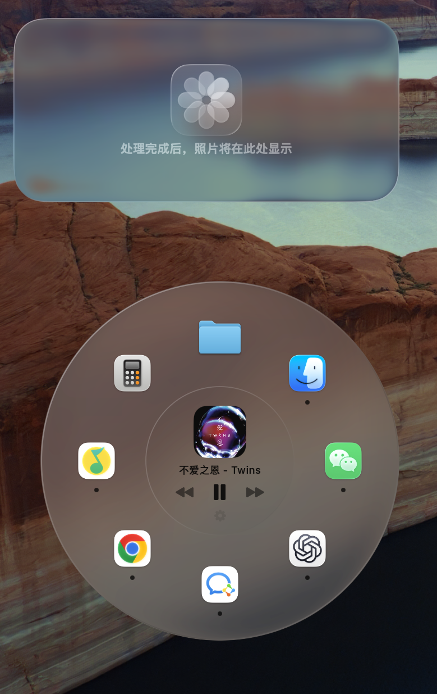
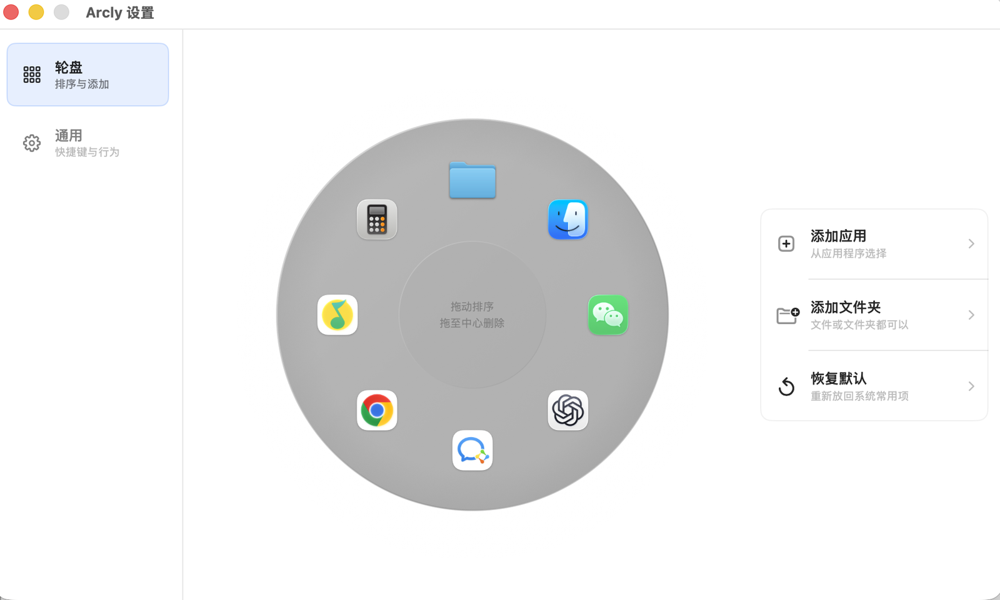

# Arcly

<p align="center">
  
</p>

<p align="center">
  <strong>A liquid-glass command wheel for macOS.</strong><br>
  <strong>一款 macOS 液态玻璃轮盘启动器。</strong>
</p>

<p align="center">
  
  
  
  
</p>

Arcly puts your everyday Mac actions under your cursor: launch apps, open files and folders, and control music from a quiet radial menu.

Arcly 把高频操作放到鼠标附近：启动应用、打开文件和文件夹、控制音乐，都在一个轻量的轮盘里完成。

Every feature is available for free. Arcly has no account requirement, paid tier, or in-app purchase.

全部功能免费开放，不需要账号，没有付费分层，也没有应用内购买。

Arcly currently requires macOS 26.0 or later.

Arcly 当前需要 macOS 26.0 或更高版本。

## Preview / 预览

<p align="center">
  
</p>

<p align="center">
  
</p>

<p align="center">
  
</p>

## Highlights / 亮点

- Liquid-glass radial menu that floats above the desktop  
  液态玻璃质感的 macOS 轮盘，轻盈覆盖在当前工作区上
- Launch apps, files, and folders from fixed wheel slots  
  常用应用、文件、文件夹可以固定到轮盘槽位
- Playback controls in the center, with track info where the system allows it  
  中心区域提供播放控制，在系统允许的情况下同时显示当前曲目
- Hotkey and mouse-trigger launch modes  
  支持快捷键唤出，也支持鼠标按键触发
- Adjustable radius, icon size, opacity, theme, and position  
  可调整半径、图标大小、透明度、主题和唤出位置
- English and Simplified Chinese UI, following the macOS system language  
  支持英文和简体中文界面，自动跟随 macOS 系统语言

## Download / 下载

Download the latest DMG from [GitHub Releases](https://github.com/chillintheshade/Arcly/releases/latest), then drag `Arcly.app` into `/Applications`.

从 [GitHub Releases](https://github.com/chillintheshade/Arcly/releases/latest) 下载最新 DMG，然后把 `Arcly.app` 拖到 `/Applications`。

This self-distributed build is ad-hoc signed, but not notarized by Apple yet. If macOS says Arcly cannot be verified or is damaged, install it to `/Applications` first, then run:

当前自分发版本采用临时签名，但还没有经过 Apple notarization。如果 macOS 提示无法验证或 App 已损坏，先拖到 `/Applications`，再运行：

```bash
sudo xattr -dr com.apple.quarantine /Applications/Arcly.app
```

After that, open Arcly again.

然后重新打开 Arcly。

## Build From Source / 从源码构建

```bash
swift build -c release
for test in work/*-test.py; do python3 "$test" || exit 1; done
xcodebuild -project Arcly.xcodeproj -scheme Arcly -configuration Release build CODE_SIGNING_ALLOWED=NO
```

The Swift package build is the fast compile check. Use the Xcode project to produce the full `.app` with assets and localized resources.

Swift Package 用于快速编译检查；需要完整 App、图标和本地化资源时，请使用 Xcode 工程构建。

The bundle identifier still uses `com.qingshan.orbis` to preserve update compatibility. The user-facing app name is `Arcly`.

为了兼容旧版本更新，bundle identifier 仍然保留 `com.qingshan.orbis`；用户看到的名称是 `Arcly`。

## Music Support / 音乐功能说明

**Everything works out of the box on every Mac — no developer tools required.** When available, playback controls use the bundled MediaRemote adapter; system media keys are a fallback only. Track name and artwork are read through the same helper framework ([mediaremote-adapter](https://github.com/ungive/mediaremote-adapter), BSD-3-Clause), which runs on the system's Apple-signed Perl interpreter. Placeholder play brings the preferred running player forward and records a short-lived intent; Play is sent only after that player exposes a controllable session, so an ownerless media key cannot accidentally launch Apple Music.

**所有功能开箱即用，不需要安装任何开发工具。** 播放控制优先通过打包的 MediaRemote adapter 发送，只有 adapter 不可用时才退回系统媒体按键。占位状态点击播放会把优先播放器带到前台并记录短时意图；目标播放器建立可控会话后才补发播放，因此不会因无会话所有者而误启 Apple Music。歌名和封面由同一个 helper 框架（[mediaremote-adapter](https://github.com/ungive/mediaremote-adapter)，BSD-3-Clause 协议）读取，它借助系统自带、Apple 签名的 Perl 解释器运行。

## Notes / 说明

- Arcly ships as one free feature set; there is no Pro tier or purchase flow.
  Arcly 只有一套完整免费功能，不再包含 Pro 分层或购买流程。
- Music metadata relies on Apple's private MediaRemote framework, which suits self-distribution but is not App Store compatible.
  音乐信息依赖 Apple 的私有 MediaRemote framework，适合自行分发，但不符合 App Store 上架要求。

## Support / 支持

If Arcly matches the way you like to work on macOS, starring the repo helps more people find it.

如果你喜欢这种 macOS 轮盘式工作流，给这个仓库一个 star 会帮助更多人看到它。

## License / 许可协议

Arcly is released under the [GNU General Public License v3.0](LICENSE). You may use, modify, and redistribute it freely, provided that derivative works are also released under the GPL-3.0 with their source code available.

Arcly 基于 [GNU General Public License v3.0](LICENSE) 发布。你可以自由使用、修改和再分发，但衍生作品同样需要以 GPL-3.0 开源并提供源码。

Arcly bundles [mediaremote-adapter](https://github.com/ungive/mediaremote-adapter) by Jonas van den Berg and contributors, licensed under the BSD 3-Clause License — see [Vendor/MediaRemoteAdapter/LICENSE](Vendor/MediaRemoteAdapter/LICENSE).

Arcly 内置了 Jonas van den Berg 及贡献者开发的 [mediaremote-adapter](https://github.com/ungive/mediaremote-adapter)（BSD 3-Clause 协议），协议全文见 [Vendor/MediaRemoteAdapter/LICENSE](Vendor/MediaRemoteAdapter/LICENSE)。
